# Rate Limited Wget for Posix Shell Script
Respect website and API rate limits when retrieving with `wget`.

The `rate_limited_wget` library contains Posix compliant shell functions to delay
some wget requests to comply with rate limits imposed by websites and APIs.
The library supports shell scripts, such as installation scripts, that make large numbers
of `wget` requests to GitHub or other rate limited websites.

## Usage

### Installation

Download the library from https://github.com/jshprentz/rate_limited_wget/blob/main/lib/rate_limited_wget.sh

For example, a shell script can download the library if necessary. (This `wget` will not count toward
rate limits.)
```shell
if [ ! -f rate_limited_wget.sh ]; then
        wget https://github.com/jshprentz/rate_limited_wget/blob/main/lib/rate_limited_wget.sh
fi
```

The script must load the library before calling its functions. For example,
```shell
. rate_limited_wget.sh
```

### Initialization

The `init_wget_rate_limit` function initializes a rate limit with the _number of requests_
permitted during a _time period_ by one or more _hosts._
The function signature is:
```shell
init_wget_rate_limit requests period host...
```
where
- _requests_ is the number of requests allowed
- _period_ is the length in seconds of the time period
- _host_ is the fully qualified domain name used a a host in a URL

#### Examples

A website limits requests to 15 per minute (i.e., 60 seconds).
```shell
init_wget_rate_limit 15 60 www.example.com
```

A website with multiple hostnames limits requests to a total of 100 per hour (3600 seconds).
```shell
init_wget_rate_limit 100 3600 www.example.com api.example.com media.example.com
```

A website has both a short term limit and a long term limit. Two rate limits are needed.
```shell
init_wget_rate_limit 15 60 www.example.com
init_wget_rate_limit 100 3600 www.example.com
```

A website has a rate limit, as above, and is in a group of websites with a daily contractual
limit of 1000 requests. (Those other websites may have additional rate limits, not shown below.)
```shell
init_wget_rate_limit 15 60 www.example.com
init_wget_rate_limit 1000 86400 www.example.com www.sample.com api.foo.com media.bar.com
```

### Wget Requests

Replace `wget` with `rate_limited_wget` to rate-limit the request.
`rate_limited_wget` will extract hostnames from all URLs, lookup related rate limits,
wait until they time out, and pass all arguments to `wget`.
For example,
```shell
rate_limited_wget -q https://www.example.com/media/1234.mp4 -O cat-video.mp4 --no-cache
```

When multiple URLs appear, they all are rate limited.
In this example, `rate_limited_wget` waits until two requests may proceed, invokes `wget`
to make the requests, and tracks the two request times.
```shell
rate_limited_wget https://www.example.com/media/1234.mp4 https://www.example.com/media/5678.mp4
```

For scripting convenience, define a variable to reduce typing and apply desired `wget` options:
```shell
WGET="rate_limited_wget -q"
```
Use the variable in place of `wget` or `rate_limited_wget`:
```shell
$WGET https://www.example.com/media/1234.mp4 -O cat-video.mp4 --no-cache
```

### Tracking Extra Requests

The `rate_limited_extra` function tracks `wget` (and similar) requests made without
using `rate_limited_wget`.
Those include requests made before the `rate_limited_wget` library was loaded
and requests made by other scripts.
Websites will count those requests toward their rate limits, so they should be tracked locally.

The function signature is:
```shell
rate_limited_extra host...
```

#### Example

A script downloads the `rate_limited_extra` library using `wget` as described [above](#installation).
This download counts towards GitHub's rate limits.
The script can track this download locally in a shell variable, which later can be passed to
the `rate_limited_extra` function.

The example code below

1. downloads the library if necessary,
2. notes the download in a shell variable,
3. loads the library,
4. initializes a rate limit for GitHub, and 
5. tracks the possible extra download in the GitHub rate limit.

```shell
if [ ! -f rate_limited_wget.sh ]; then
        wget https://github.com/jshprentz/rate_limited_wget/blob/main/lib/rate_limited_wget.sh
        extra_download="github.com"
fi

. rate_limited_wget.sh

init_wget_rate_limit 60 3600 github.com

rate_limited_extra $extra_download
```

## Theory of Operation

### Web Requests Without Rate Limits

A typical installation script alternates between downloading files and installing them.
This timeline show a sequence `wget` commands that initiate 1-second downloads followed
by 2-seconds installations.
The timings are examples for illustrative purposes.
These activites proceed one after another without any delay.

```mermaid
gantt
    title Scripted Downloads and Installs (times in seconds)
    dateFormat  s
    axisFormat %S
    wget 1                :milestone, m1, 0, 0s
    Download              :d1, after m1, 1s
    Install               :i1, after d1, 2s
    wget 2                :milestone, m2, after i1, 0s
    Download              :d2, after m2, 1s
    Install               :i2, after d2, 2s
    wget 3                :milestone, m3, after i2, 0s
    Download              :d3, after m3, 1s
    Install               :i3, after d3, 2s
    wget 4                :milestone, m4, after i3, 0s
    Download              :d4, after m4, 1s
    Install               :i4, after d4, 2s
    wget 5                :milestone, m5, after i4, 0s
    Download              :d5, after m5, 1s
    Install               :i5, after d5, 2s
    wget 6                :milestone, m6, after i5, 0s
    Download              :d6, after m6, 1s
    Install               :i6, after d6, 2s
```



### Rate Limits

Many websites impose rate limits on web requests.
For example [GitHub](https://docs.github.com/en/rest/using-the-rest-api/rate-limits-for-the-rest-api?apiVersion=2022-11-28#primary-rate-limit-for-unauthenticated-users)
limits unauthenticated users to 60 requests per hour.
Some websites have both short term rate limits—to limit bursts— and long term rate limits—to reduce overall load.
Rate limits may be imposed by a web server or may be the subject of a commercial agreement; an API subscription might
specify some level of service provided.

### Modeling Rate Limits

In the library, the completion of each `wget` request begins a time period during which a limited number of requests are allowed.
The count starts at 1 for the just-completed `wget` request.
Once the request count reaches the limit, additional requests must wait until the time period has elapsed.

This timeline shows the six example requests (from above) rate limited to 4 requests per 20 seconds.
The first four requests are executed without delay.
The fifth request cannot begin until the conclusion the rate limit time period starting after the first download request.
The sixth request proceeds without delay.

```mermaid
gantt
    title Rate Limited Downloads and Installs (times in seconds)
    dateFormat  s
    axisFormat %S
    rate_limited_wget 1   :milestone, w1, 0, 0
    Download              :d1, after w1, 1s
    Limit of 4 requests   :done, l1, after d1, 20s
    Install               :i1, after d1, 2s
    rate_limited_wget 2    :milestone, w2, after i1, 0s
    Download              :d2, after w2, 1s
    Limit of 4 requests   :done, after d2, 20s
    Install               :i2, after d2, 2s
    rate_limited_wget 3   :milestone, w3, after i2, 0s
    Download              :d3, after w3, 1s
    Limit of 4 requests   :done, after d3, 20s
    Install               :i3, after d3, 2s
    rate_limited_wget 4   :milestone, w4, after i3, 0s
    Download              :d4, after w4, 1s
    Limit of 4 requests   :done, after d4, 20s
    Install               :i4, after d4, 2s
    rate_limited_wget 5   :milestone, w5, after i4, 0s
    Delay                 :crit, delay5, after w5, until d5
    Download              :d5, after l1, 1s
    Limit of 4 requests   :done, after d5, 20s
    Install               :i5, after d5, 2s
    rate_limited_wget 6   :milestone, w6, after i5, 0s
    Download              :d6, after w6, 1s
    Limit of 4 requests   :done, after d6, 20s
    Install               :after d6, 2s
```



The library represents each rate limit as a list of _ready times,_ the times when the rate limit time periods end.
The ready times after the first four requests above are: 21, 24, 27, and 30.

The fifth `rate_limited_wget` request comes before the earliest ready time, 21 seconds, so the
rate limiter will delay the request until time 21.
After the fifth download completes, the ready times are: 24, 27, 30, and 42.

The sixth `rate_limited_wget` request comes at the earliest ready time, 24 seconds, so the
rate limiter executes the `wget` download immediately.
After the sixth download completes, the ready times are: 27, 30, 42 and 45.

## Limitation

Some scripts may encounter limitations because the library represents ready times as
lists of 10-digit integers stored in strings and shell argument lists.

### Time Granularity

The library's one-second time granularity may not be appropriate for all applications.

The library represents ready times as integer Linux epoch seconds, the value reported by
the command:
```shell
date "+%s"
```
For example the May 19, 2025 at 00:00 Z is 1747612800.

One-second granularity matches the library's intended use in shell scripts that download,
unpack, compile, and install many files.
The times for those activities range from partial seconds to multiple minutes.

One-second granularity is sufficient for rate limits with time periods typically specified
in minutes, hours, or days.
This granularity would be too coarse for rate limits with time periods specified in
seconds or less and too fine for rate limits specified in months or years.

### Number of Requests

The number of requests tracked could be limited by the ready list implementation.

The library stores lists of ready times—one for each request, up to the limit—in shell variables.
The example ready times (above) would be stored in a string as `"27 30 42 45"`.

Ready times are tracked as Linux epoch seconds, so the example ready times,
if the script was started at May 19, 2025 at 00:00 Z, would be the string
'"1747612827 1747612830 1747612842 1747612845"`.
A ready time list containing $n$ 10-digit space-separated times would have
a string length of approximately $11 n$ characters.

The library often passes ready lists as arguments to shell functions.
A shell represents an argument list as an array of pointers to null-terminated strings.
A null-terminated string holding 10-digit time consumes at least 11 bytes.
Pointers on modern 64-bit processors typically take 8 bytes.
A shell argument list of $n$ ready times requires at least $(11 + 8) n$ bytes.

The following table shows the argument list storage requirements are acceptable
for some common download sites.

| Site | Number of Requests | Time Period | Ready Time Argument List Size (bytes) |
|------|-------------------:|-------------|---------------------------:|
| GitHub | 60 | per hour | 1,140 |
| GitLab | 5 | per minute | 95 |
| Wikimedia | 500 | per hour | 9,500 |

These sizes are far below the limits in shells running on modern computers.

```
$ xargs --no-run-if-empty --show-limits </dev/null
Your environment variables take up 2369 bytes
POSIX upper limit on argument length (this system): 2092735
POSIX smallest allowable upper limit on argument length (all systems): 4096
Maximum length of command we could actually use: 2090366
Size of command buffer we are actually using: 131072
Maximum parallelism (--max-procs must be no greater): 2147483647
```

