# rate_limited_wget
Respect website and API rate limits when retrieving with ```wget```.

The ```rate_limited_wget``` library contains Posix compliant shell functions to delay
some wget requests to comply with rate limits imposed by websites and APIs.
The library supports shell scripts, such as installation scripts, that make large numbers
of ```wget``` requests to GitHub or other rate limited websites.

## Usage

### Installation

Download the library from https://github.com/jshprentz/rate_limited_wget/blob/main/lib/rate_limited_wget.sh

For example, a shell script can download the library if necessary. (This ```wget``` will not count toward
rate limits.)
```shell
if [ ! -f rate_limited_wget.sh ]; then
        wget https://github.com/jshprentz/rate_limited_wget/blob/main/lib/rate_limited_wget.sh
fi
```

The script must load the library before calling its functions. For example,
```shell
. rate_limited_wget.sh
```

### Initialization

The ```init_wget_rate_limit``` function initializes a rate limit with the _number of requests_
permitted during a _time period_ by one or more _hosts._
The function signature is:
```shell
init_wget_rate_limit requests period host...
```
where
- _requests_ is the number of requests allowed
- _period_ is the length in seconds of the time period
- _host_ is the fully qualified domain name used a a host in a URL

#### Examples

A website limits requests to 15 per minute (i.e., 60 seconds).
```shell
init_wget_rate_limit 15 60 www.example.com
```

A website with multiple hostnames limits requests to a total of 100 per hour (3600 seconds).
```shell
init_wget_rate_limit 100 3600 www.example.com api.example.com media.example.com
```

A website has both a short term limit and a long term limit. Two rate limits are needed.
```shell
init_wget_rate_limit 15 60 www.example.com
init_wget_rate_limit 100 3600 www.example.com
```

A website has a rate limit, as above, and is in a group of websites with a daily contractual
limit of 1000 requests. (Those other websites may have additional rate limits, not shown below.)
```shell
init_wget_rate_limit 15 60 www.example.com
init_wget_rate_limit 1000 86400 www.example.com www.sample.com api.foo.com media.bar.com
```

### Wget Requests

Replace ```wget``` with ```rate_limited_wget``` to rate-limit the request.
```rate_limited_wget``` will extract hostnames from all URLs, lookup related rate limits,
wait until they time out, and pass all arguments to ```wget```.
For example,
```shell
rate_limited_wget -q https://www.example.com/media/1234.mp4 -O cat-video.mp4 --no-cache
```

When multiple URLs appear, they all are rate limited.
In this example, ```rate_limited_wget``` waits until two requests may proceed, invokes ```wget```
to make the requests, and tracks the two request times.
```shell
rate_limited_wget https://www.example.com/media/1234.mp4 https://www.example.com/media/5678.mp4
```

For scripting convenience, define a variable to reduce typing and apply desired ```wget``` options:
```shell
WGET="rate_limited_wget -q"
```
Use the variable in place of ```wget``` or ```rate_limited_wget```:
```shell
$WGET https://www.example.com/media/1234.mp4 -O cat-video.mp4 --no-cache
```

### Tracking Extra Requests

The ```rate_limited_extra``` function tracks ```wget``` (and similar) requests made without
using ```rate_limited_wget```.
Those include requests made before the ```rate_limited_wget``` library was loaded
and requests made by other scripts.
Websites will count those requests toward their rate limits, so they should be tracked locally.

The function signature is:
```shell
rate_limited_extra host...
```

### Example

A script downloads the ```rate_limited_extra``` library using ```wget``` as described [above](#installation).
This download counts towards GitHub's rate limits.
The script can track this download locally in a shell variable, which later can be passed to
the ```rate_limited_extra``` function.

The example code below

1. downloads the library if necessary,
2. notes the download in a shell variable,
3. loads the library,
4. initializes a rate limit for GitHub, and 
5. tracks the possible extra download in the GitHub rate limit.

```shell
if [ ! -f rate_limited_wget.sh ]; then
        wget https://github.com/jshprentz/rate_limited_wget/blob/main/lib/rate_limited_wget.sh
        extra_download="github.com"
fi

. rate_limited_wget.sh

init_wget_rate_limit 60 3600 github.com

rate_limited_extra $extra_download
```

## Theory of Operation

### Rate Limits

Many websites impose rate limits on web requests.
For example [GitHub](https://docs.github.com/en/rest/using-the-rest-api/rate-limits-for-the-rest-api?apiVersion=2022-11-28#primary-rate-limit-for-unauthenticated-users)
limits unauthenticated users to 60 requests per hour.
Some websites have both short term rate limits—to limit bursts— and long term rate limits—to reduce overall load.
Rate limits may be imposed by a web server or may be the subject of a commercial agreement; an API subscription might
specify some level of service provided.

### Modeling Rate Limits

In the library, each ```wget``` request begins a time period during which a limited number of requests are allowed.
Once the request count reaches the limit, additional requests must wait until the time period has elapsed.

This timeline shows six requests that are rate limited to 4 requests per 10 seconds.
The first four requests are executed without delay.
(The example timing of these requests reflects time needed to decompress, unpack, and compile code.)
The fifth request cannot begin until after the rate limit time period starting with the first event.
Similarly, the sixth request cannot begin until after the rate limit time period starting with the second event.

```mermaid
gantt
    title Rate Limit: 4 requests per 10 seconds
    dateFormat  s
    axisFormat %S
    wget 1                :milestone, 0, 0
    Limit 4 requests     :0, 10s
    wget 2                :milestone, 3, 3
    Limit 4 requests     :3, 10s
    wget 3                :milestone, 4, 4
    Limit 4 requests      :4, 10s
    wget 4                :milestone, 7, 7
    Limit 4 requests      :7, 10s
    wget 5                :milestone, 10, 10
    Limit 4 requests     :10, 10s
    wget 6                :milestone, 13, 13
    Limit 4 requests     :13, 10s
```



Each rate limit has a list of _ready times,_ the times when the rate limit time periods end.
The ready times after the sixth request above are: 14, 17, 20, and 23.

If the next ```wget``` request comes before the earliest ready time, 14 seconds, the
rate limiter wil delay the request until time 14.
If the next request comes after the earliest ready time, the request will be executed immediately.

In either case, the earliest ready time will be replaced in the list by a new ready time:
the sum of the current time (14 or later) plus the rate limit period (10 seconds).
For example, if the request completed at time 15, the ready time list would then contain:
17, 20, 23, and 25.

The library represents ready times as integer Linux epoch seconds, the value reported by
the command:
```shell
date "+%s"
```
One-second granularity is sufficient for rate limits with time periods typically specified
in minutes, hours, or days.
